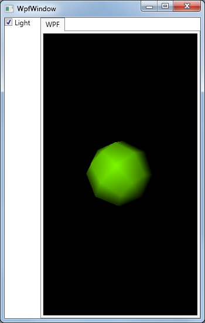

# NoToolkitWpfApp

Created by Mariusz K. (mkre@op.pl)

###This is a demo that shows how to run SharpDX 3.0 hosted in WPF without SharpDX.Toolkit.

##Parts are taken from:

- SharpDX Samples 
    http://github.com/sharpdx/SharpDX.git
- SharpDX DirectX11 Tutorial 
    http://www.notjustcode.it 
- SharpDX.Toolkit
    https://github.com/sharpdx/Toolkit

    
##Requires:
- .Net 4.5
- DirectX11
- SharpDX 3.0+ (via NuGet)

##Features:
- WPF application
- no SharpDX.Toolkit required
- directional light implemented by shader
- compilation of shaders during runtime
 

##Licensing:
- WTFPL